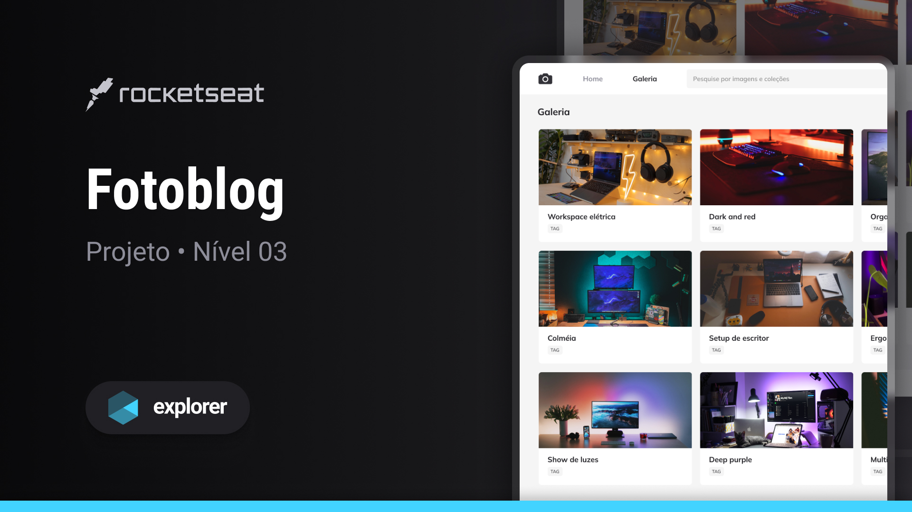

# Fotoblog

Esse projeto de galeria de fotos é desenvolvido no nível 03 do Explorer, programa completo da [Rocketseat](https://www.rocketseat.com.br/)

## :rocket: Tecnologias

Esse projeto foi desenvolvido com as seguintes tecnologias:

- HTML e CSS
- Git e Github
- Figma

## :computer: Projeto

O Fotoblog é uma simples landing page com o objetivo de colocar em prática conteúdos aprendidos como:

- Unidade de medida flexível;
- Grid;
- Variáveis no CSS;
- Cores HSL;
- Animações e transições simples.

